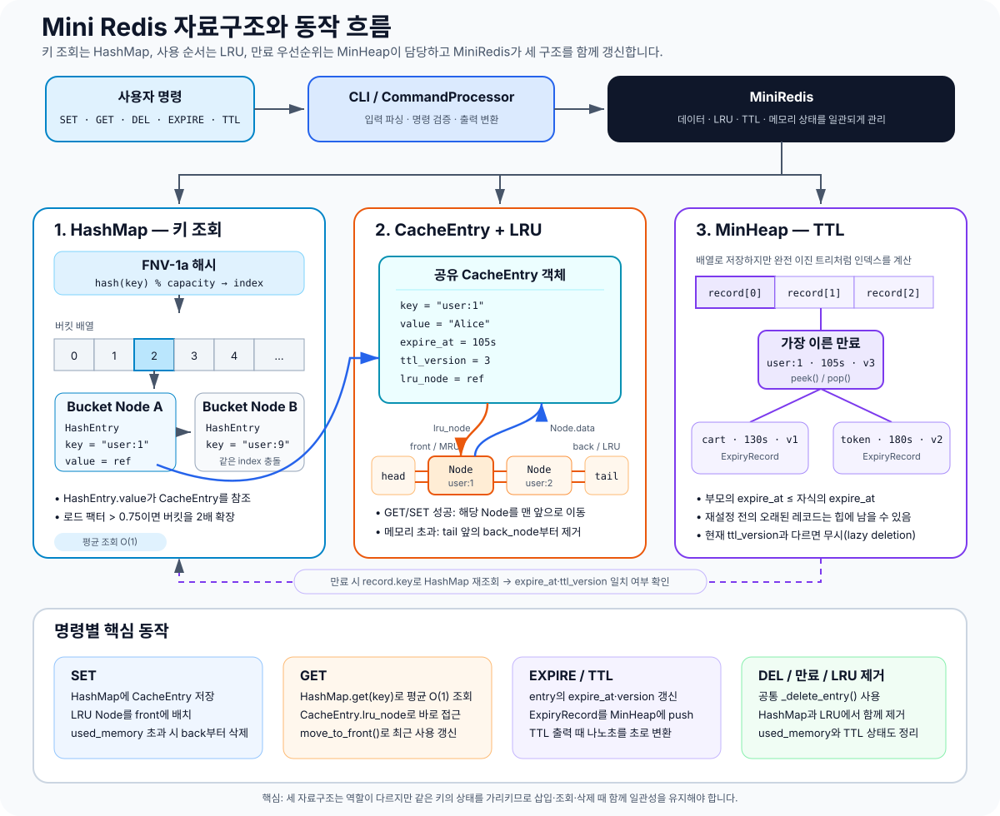

# Mini Redis

Python의 내장 Key-Value 컬렉션에 의존하지 않고 Redis의 핵심 동작을 직접 구현한 교육용 CLI 프로젝트입니다.

체이닝 해시맵, 이중 연결 리스트, 최소 힙을 밑바닥부터 구현하고 이를 조합해 String 명령, O(1) LRU 추적, 메모리 제한, TTL 만료를 제공합니다.

## 주요 기능

- String 명령: `SET`, `GET`, `DEL`, `EXISTS`, `DBSIZE`, `KEYS`
- 메모리 명령: `CONFIG SET maxmemory`, `INFO memory`
- TTL 명령: `EXPIRE`, `TTL`
- 이중 연결 리스트와 해시맵을 조합한 O(1) LRU 갱신
- 최소 힙과 lazy deletion을 이용한 TTL 관리
- UTF-8 바이트 기준 메모리 계산과 LRU 자동 제거
- 큰따옴표로 감싼 공백 포함 값 파싱
- Redis 스타일 응답과 오류 출력

## 요구 환경

- Python 3.10 이상
- 외부 패키지 없음

## 실행 방법

저장소를 받은 뒤 프로젝트 루트에서 실행합니다.

```bash
git clone https://github.com/hkk-cody/B3-1.git
cd B3-1
python3 main.py
```

실행하면 `mini-redis>` 프롬프트가 나타납니다. `exit`, `quit`, EOF 또는 `Ctrl+C`로 종료할 수 있습니다.

```text
mini-redis> SET user:1 "Alice Smith"
OK
mini-redis> GET user:1
"Alice Smith"
mini-redis> EXISTS user:1
(integer) 1
mini-redis> DBSIZE
(integer) 1
mini-redis> quit
```

## 지원 명령

| 명령 | 설명 | 주요 출력 |
| --- | --- | --- |
| `SET key value` | 문자열 값을 저장하고 LRU를 갱신 | `OK` |
| `GET key` | 값을 조회하고 성공한 경우 LRU를 갱신 | `"value"`, `(nil)` |
| `DEL key` | 데이터·LRU·TTL 상태를 함께 삭제 | `(integer) 0/1` |
| `EXISTS key` | 키 존재 여부 확인 | `(integer) 0/1` |
| `DBSIZE` | 현재 유효한 키 개수 조회 | `(integer) N` |
| `KEYS` | 전체 키 조회, 순서는 보장하지 않음 | 번호가 붙은 키 목록 |
| `CONFIG SET maxmemory bytes` | 최대 메모리 제한 설정, `0`은 무제한 | `OK` |
| `INFO memory` | 사용량·제한·제거 횟수 조회 | 메모리 정보 3줄 |
| `EXPIRE key seconds` | 키의 만료 시간 설정 | `(integer) 0/1` |
| `TTL key` | 남은 만료 시간 조회 | `(integer) N` |

`TTL`은 키가 없으면 `-2`, 만료 시간이 없으면 `-1`, 만료 시간이 있으면 남은 초를 반환합니다. `EXPIRE`에 0 이하를 전달하면 키가 즉시 만료됩니다.

## 메모리 제한과 LRU

메모리 사용량은 자료구조 자체의 오버헤드를 제외하고 키와 값의 UTF-8 바이트 길이만 계산합니다.

```text
used_memory = Σ(len(utf8(key)) + len(utf8(value)))
```

`SET` 이후 `used_memory`가 `maxmemory`를 초과하면 가장 오래 사용되지 않은 키부터 제거합니다. 단일 키·값 엔트리 자체가 제한보다 크면 기존 상태를 변경하지 않고 OOM 오류를 반환합니다.

```text
mini-redis> CONFIG SET maxmemory 30
OK
mini-redis> SET user:1 "Alice"
OK
mini-redis> SET user:2 "Bob"
OK
mini-redis> SET user:3 "Charlie"
OK
mini-redis> GET user:1
(nil)
mini-redis> INFO memory
used_memory:22
maxmemory:30
evicted_keys:1
```

## 내부 구조



`CommandProcessor`는 입력을 해석하고, `MiniRedis`는 명령 하나가 여러 자료구조에 미치는 변화를 조정합니다. 그림은 왼쪽에서 오른쪽으로 `HashMap`의 키 조회, 공유 `CacheEntry`와 LRU 순서, `MinHeap`의 TTL 우선순위를 보여줍니다.

### 그림 읽는 순서

1. 명령이 들어오면 `CommandProcessor`가 토큰과 인수를 검사한 뒤 `MiniRedis` 메서드를 호출합니다.
2. `HashMap`은 FNV-1a 해시로 버킷을 고르고, 충돌한 키는 버킷의 이중 연결 리스트에서 찾습니다. `HashEntry.value`는 실제 상태를 가진 `CacheEntry`를 참조합니다.
3. LRU 리스트의 각 `Node.data`도 같은 `CacheEntry`를 참조합니다. 반대로 `CacheEntry.lru_node`가 자신의 LRU 노드를 기억하므로 조회 후 다시 탐색하지 않고 O(1)에 맨 앞으로 이동할 수 있습니다.
4. `EXPIRE`는 `CacheEntry`의 만료 상태를 갱신하고 별도의 `ExpiryRecord`를 최소 힙에 넣습니다. 만료 시에는 레코드의 키로 해시맵을 다시 조회하고 `expire_at`과 `ttl_version`이 모두 일치할 때만 삭제합니다.
5. `DEL`, TTL 만료, 메모리 초과 제거는 공통 `_delete_entry()`를 사용해 해시맵, LRU, 메모리 사용량, TTL 상태를 함께 정리합니다.

### 이중 연결 리스트

head/tail sentinel을 사용합니다. 노드 참조를 직접 연결하거나 해제하므로 삽입, 삭제, `move_to_front`가 O(1)입니다.

### 해시맵

UTF-8 바이트 기반 64-bit FNV-1a 해시를 사용합니다. 충돌은 이중 연결 리스트 체이닝으로 해결하고, 로드 팩터가 0.75를 초과하면 버킷을 2배로 확장합니다.

### HashMap과 LRU의 CacheEntry 공유

해시맵과 LRU 리스트는 서로 다른 `Node`를 사용하지만, 두 노드가 같은 `CacheEntry` 객체를 참조합니다.

해시맵에서는 키로 `CacheEntry`를 찾고, `CacheEntry.lru_node`를 이용해 LRU 리스트의 위치에 바로 접근합니다. 따라서 키를 찾은 뒤 LRU 리스트를 다시 순회하지 않고 O(1)에 맨 앞으로 이동할 수 있습니다.

### 최소 힙과 TTL

힙에는 `(expire_at, ttl_version, key)`에 해당하는 레코드를 저장합니다. TTL 재설정·삭제·덮어쓰기로 오래된 레코드가 남더라도 현재 엔트리의 버전과 비교해 무시하는 lazy deletion 전략을 사용합니다.

## 프로젝트 구조

```text
.
├── README.md
├── main.py
├── docs/
│   ├── code-analysis-guide.md
│   ├── mini-redis-architecture.svg
│   ├── subject.md
│   └── spec.md
├── mini_redis/
│   ├── cli.py
│   ├── commands.py
│   ├── hash_map.py
│   ├── linked_list.py
│   ├── min_heap.py
│   └── store.py
└── tests/
```

## 테스트

전체 테스트는 Python 표준 라이브러리 `unittest`로 실행합니다.

```bash
python3 -m unittest discover -s tests -v
```

테스트 범위는 다음을 포함합니다.

- 연결 리스트의 삽입·삭제·이동과 잘못된 노드 처리
- 해시 충돌, CRUD, 로드 팩터 확장
- 최소 힙 정렬과 중복 우선순위
- UTF-8 메모리 계산과 LRU 제거
- 원자적 OOM, TTL 재설정, stale heap 레코드
- 모든 명령의 정상·오류 출력과 REPL 통합 실행
- 제품 코드의 `dict`, `set`, `collections` 사용 금지 검사

컴파일과 공백 오류까지 함께 확인하려면 다음 명령을 실행합니다.

```bash
python3 -m compileall -q mini_redis main.py
python3 -m unittest discover -s tests -v
git diff --check
```

## 구현 제약

- 제품 코드에서 `dict`, `set`, `collections`를 사용하지 않습니다.
- Python `list`는 해시맵 버킷과 힙의 배열 저장소 용도로만 사용합니다.
- 네트워크 통신, 파일 영속성, 동시성 처리는 포함하지 않습니다.
- Redis의 List, Set, Sorted Set 같은 복잡 자료형은 포함하지 않습니다.

## 문서

- [과제 원문](docs/subject.md)
- [기술 명세](docs/spec.md)
- [코드 분석 가이드](docs/code-analysis-guide.md)
