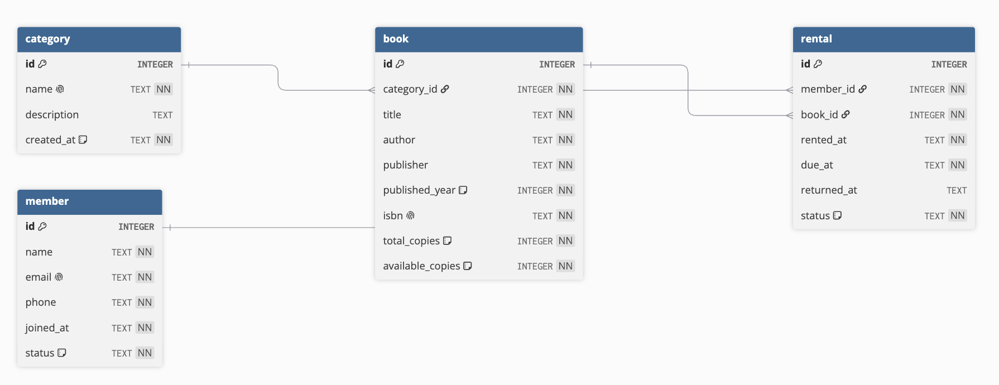

# 도서 대여 데이터베이스 ERD

이 문서는 도서 대여 관리 데이터베이스의 테이블 관계를 정리한 ERD입니다.
ERD에는 직접 설계한 도메인 테이블만 포함합니다.
SQLite가 내부적으로 `AUTOINCREMENT` 값을 관리하기 위해 사용하는 `sqlite_sequence`는 ERD에 포함하지 않습니다.

## ERD 이미지

## 관계 설명

| 관계 | 설명 |
| --- | --- |
| `category` 1 : N `book` | 카테고리 하나에 여러 책이 속할 수 있습니다. |
| `member` 1 : N `rental` | 회원 한 명은 여러 번 책을 빌릴 수 있습니다. |
| `book` 1 : N `rental` | 책 한 권은 여러 번 대여 기록에 등장할 수 있습니다. |

## 표시 설명

| 표시 | 의미 |
| --- | --- |
| 열쇠 아이콘 | `PRIMARY KEY`, 각 행을 구분하는 기본 키 |
| 연결 아이콘 | `FOREIGN KEY`, 다른 테이블을 참조하는 외래 키 |
| 지문 아이콘 | `UNIQUE`, 중복을 허용하지 않는 값 |
| `NN` | `NOT NULL`, 반드시 값이 있어야 하는 컬럼 |
| `NN` 없음 | 값을 비워둘 수 있는 컬럼 |

## 테이블 설명

| 테이블 | 설명 |
| --- | --- |
| `category` | 도서 카테고리 정보를 저장합니다. |
| `member` | 도서관 회원 정보를 저장합니다. |
| `book` | 도서 정보와 카테고리 연결 정보를 저장합니다. |
| `rental` | 회원이 어떤 책을 언제 빌렸는지 저장합니다. |

## 설계 의도

- 회원 정보, 책 정보, 카테고리, 대여 기록을 각각 별도 테이블로 나누었습니다.
- 대여 기록인 `rental`은 `member`와 `book`을 연결하는 핵심 테이블입니다.
- 책의 분야는 `category`로 분리해서 같은 카테고리 이름을 여러 책에 반복 저장하지 않도록 했습니다.
- `email`, `isbn`, `category.name`은 중복되면 안 되는 값이므로 `UNIQUE` 제약조건을 사용합니다.
- `description`과 `returned_at`은 비어 있을 수 있으므로 `NN` 표시가 없습니다.
